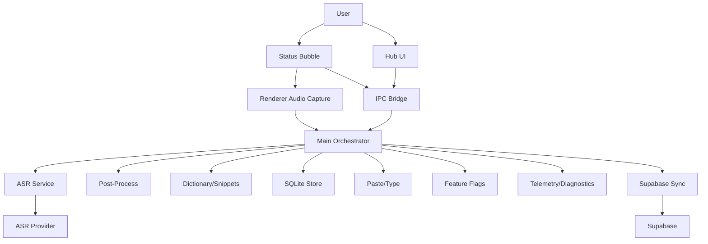
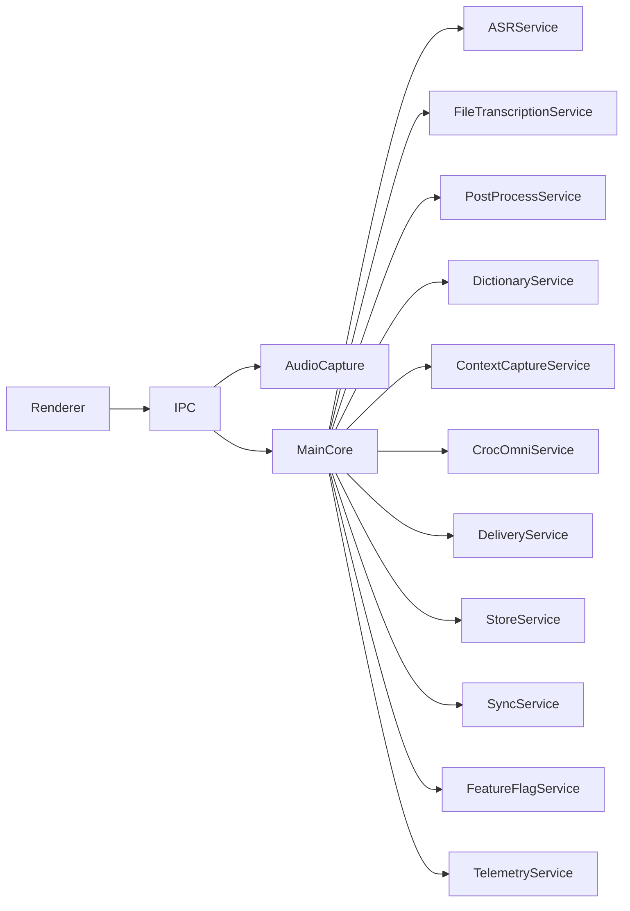
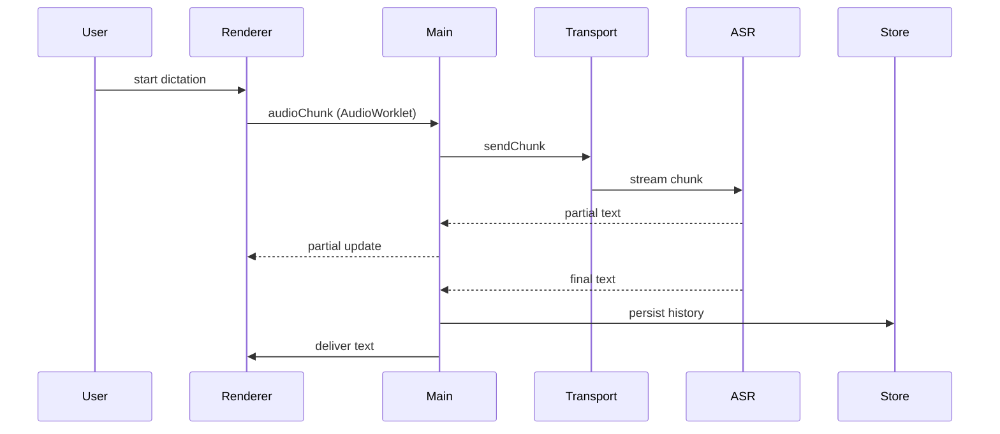

# CrocoVoice Architecture Document

## Introduction
This document outlines the overall architecture for CrocoVoice as it evolves toward FakeWispr-level robustness. It focuses on low-latency audio streaming, rich context capture, personalization, and multi-window UX while preserving a local-first, offline-friendly core.

**Relationship to Frontend Architecture:**
CrocoVoice is a desktop Electron app. Renderer UX (hub/status/context menu) is described here only to the extent it impacts system architecture, IPC, and data flows.

### Starter Template or Existing Project
Existing Electron codebase (main.js, renderer.js, preload.js, store.js, sync.js). No starter template.

### Change Log
| Date | Version | Description | Author |
| --- | --- | --- | --- |
| 2026-01-24 | v1.0 | Architecture updated for robustness parity roadmap | Architect |

## High Level Architecture

### Technical Summary
CrocoVoice remains a monolithic Electron app with modular services in the main process and multiple renderer windows (hub, status, context menu). Audio capture uses an AudioWorklet path for low-latency streaming with a file-upload fallback. Data is stored locally in SQLite and optionally synced via Supabase. Feature flags, telemetry, and diagnostics enable safe rollouts and supportability.

### High Level Overview
- **Style:** Modular monolith in Electron (main/renderer split).
- **Repo:** Monorepo (current structure).
- **Service Architecture:** Main process orchestrates pipeline; renderer focuses on UX and capture.
- **Primary Flow:** Audio capture -> streaming transport -> ASR -> post-process/personalization -> history persistence -> delivery.
- **Key Decisions:** Keep local-first SQLite source of truth; add streaming transport with fallback; isolate IPC by domain.

### High Level Project Diagram


### Architectural and Design Patterns
- **Modular Service Layer:** Split main process into focused services (Audio, ASR, Delivery, Store, Sync) for maintainability.
- **Repository Pattern:** Abstract DB access for History, Dictionary, Notes, Snippets, Flags.
- **Feature Flag Gating:** Central flag service to enable safe rollout and kill-switch.
- **Local-First Data Model:** SQLite is the source of truth; sync is best-effort.

## Tech Stack

### Cloud Infrastructure
- **Provider:** Supabase
- **Key Services:** Auth, Postgres, Edge Functions, Storage (optional)
- **Deployment Regions:** Supabase-managed (TBD)

### Technology Stack Table
| Category | Technology | Version | Purpose | Rationale |
| --- | --- | --- | --- | --- |
| Desktop Framework | Electron | ^35.7.5 | App runtime | Existing stack, supports multi-window UX |
| Runtime | Node.js | 20.x | Main process runtime | Modern LTS for Electron 35 |
| Language | JavaScript (CJS) | ES2020+ | App code | Consistent with current codebase |
| Audio Capture | Web Audio + AudioWorklet (+ optional Opus encoding) | N/A | Low-latency capture | Required for streaming chunks |
| Streaming Transport | WebSocket (ws) | TBD | Streaming audio/text | Low latency and simple integration |
| ASR | OpenAI Whisper | openai ^4.20.1 | Cloud transcription | Existing provider |
| Post-process | OpenAI Chat | openai ^4.20.1 | Formatting/polish | Existing provider |
| Local DB | SQLite | sqlite3 ^5.1.7 | Local source of truth | Existing storage |
| Sync | Supabase JS | ^2.45.4 | Optional sync | Existing stack |
| Telemetry | Sentry/PostHog | TBD | Error + product analytics | Required for robustness |
| Feature Flags | Custom + Supabase | TBD | Remote config | Safe rollout |
| Input Automation | nut-js | ^4.1.0 | Typing/paste | Existing mechanism |

## Data Models

### HistoryEntry
**Purpose:** Store transcripts, context, metrics, and versions.
**Key Attributes:**
- id, created_at, updated_at
- raw_text, formatted_text, edited_text
- app, url, window_title
- ax_text, ax_html, textbox_snapshot
- screenshot_path (optional)
- latency_ms, divergence_score
- mic_device, language

**Relationships:**
- Belongs to User (optional sync)
- References Dictionary/Snippets for applied changes (optional)

### DictionaryEntry
**Purpose:** Personal vocabulary corrections and auto-learned entries.
**Key Attributes:** phrase, replacement, source, last_used, frequency_used, is_snippet, auto_learned

### Snippet
**Purpose:** Voice cue to template expansion.
**Key Attributes:** cue, template, description, last_used

### FeatureFlag
**Purpose:** Gate behaviors and UX.
**Key Attributes:** key, enabled, payload, updated_at, source

### Notification
**Purpose:** Remote and local notifications.
**Key Attributes:** type, title, body, read, archived, created_at

### StatsSnapshot
**Purpose:** Insights and Wrapped.
**Key Attributes:** top_apps, wpm, dictation_time, streaks

### FileTranscriptionJob
**Purpose:** Track long-form file transcription progress and outcomes.
**Key Attributes:** file_path, file_name, duration_ms, status, progress, error_code

### CrocOmniConversation
**Purpose:** Store CrocOmni chats with optional context snapshots.
**Key Attributes:** title, messages_json, context_summary, created_at, updated_at

## Components

### AudioCapture (Renderer)
**Responsibility:** Capture audio via Web Audio + AudioWorklet and stream chunks to main.
**Key Interfaces:**
- startCapture(), stopCapture()
- onAudioChunk(buffer)
**Dependencies:** IPC Bridge
**Technology Stack:** Web Audio API

### StreamingTransport (Main)
**Responsibility:** Send chunks to ASR provider; manage fallback.
**Key Interfaces:**
- connect(), sendChunk(), close()
**Dependencies:** FeatureFlagService, ASRProvider
**Technology Stack:** WebSocket (optional Opus encoding)

### ASRService
**Responsibility:** Cloud or local transcription.
**Key Interfaces:** transcribeStream(), transcribeFile()
**Dependencies:** Transport, OpenAI client

### FileTranscriptionService
**Responsibility:** Orchestrate long-form file transcription and progress tracking.
**Key Interfaces:** startJob(file), cancelJob(id), getStatus(id)
**Dependencies:** ASRService, StoreService

### PostProcessService
**Responsibility:** Formatting, polish, style application.
**Key Interfaces:** postProcess(text, style)

### DictionaryService
**Responsibility:** Apply dictionary and snippets; manage auto-learn.
**Key Interfaces:** apply(text), upsert(entry), list()

### ContextCaptureService
**Responsibility:** App/url/ax/textbox/screenshot capture.
**Key Interfaces:** captureContext(), toggleSettings()

### CrocOmniService
**Responsibility:** Manage CrocOmni conversation sessions and summaries.
**Key Interfaces:** startSession(), appendMessage(), listSessions()
**Dependencies:** ContextCaptureService, StoreService

### DeliveryService
**Responsibility:** Paste/type output safely.
**Key Interfaces:** deliver(text, mode)

### StoreService
**Responsibility:** Local persistence for History/Dictionary/Notes/Snippets/Flags.
**Key Interfaces:** CRUD per entity

### SyncService
**Responsibility:** Optional sync to Supabase with conflict safety.
**Key Interfaces:** pull(), push(), reconcile()

### FeatureFlagService
**Responsibility:** Load and cache flags from local/remote.
**Key Interfaces:** getFlag(key)

### TelemetryService
**Responsibility:** Error reporting and product metrics.
**Key Interfaces:** captureError(), captureEvent()

### Component Diagram


## External APIs

### OpenAI API
- **Purpose:** Transcription and text post-processing
- **Base URL:** https://api.openai.com
- **Authentication:** API key in env
- **Rate Limits:** Provider-defined

### Supabase API
- **Purpose:** Auth and optional sync
- **Base URL:** Supabase project URL
- **Authentication:** JWT
- **Notes:** Local-first; sync is best-effort

### Stripe API
- **Purpose:** Billing and subscriptions
- **Base URL:** https://api.stripe.com
- **Authentication:** Secret key server-side

## Core Workflows


## Database Schema (SQLite sketch)
```sql
-- history
CREATE TABLE history (
  id TEXT PRIMARY KEY,
  text TEXT,
  raw_text TEXT,
  formatted_text TEXT,
  edited_text TEXT,
  app TEXT,
  url TEXT,
  ax_text TEXT,
  ax_html TEXT,
  screenshot_path TEXT,
  latency_ms INTEGER,
  divergence_score REAL,
  mic_device TEXT,
  language TEXT,
  created_at TEXT,
  updated_at TEXT
);

-- dictionary
CREATE TABLE dictionary (
  id TEXT PRIMARY KEY,
  phrase TEXT,
  replacement TEXT,
  source TEXT,
  last_used TEXT,
  frequency_used INTEGER,
  is_snippet INTEGER,
  auto_learned INTEGER
);

-- snippets
CREATE TABLE snippets (
  id TEXT PRIMARY KEY,
  cue TEXT,
  template TEXT,
  description TEXT,
  last_used TEXT
);
```

## Source Tree
```text
.
├── main.js
├── renderer.js
├── preload.js
├── store.js
├── sync.js
├── services/
│   ├── audio-capture.js
│   ├── streaming-transport.js
│   ├── asr-service.js
│   ├── post-process.js
│   ├── dictionary-service.js
│   ├── context-capture.js
│   ├── delivery-service.js
│   ├── feature-flags.js
│   └── telemetry.js
├── windows/
│   ├── hub/
│   ├── status/
│   └── context-menu/
└── docs/
```

## Infrastructure and Deployment
- **IaC:** Not required currently.
- **Strategy:** Standard Electron packaging; Supabase functions deployed separately.
- **Environments:** local dev, production.

## Error Handling Strategy
- **Error Model:** Typed error objects with category + severity.
- **Logging:** Structured logs with redaction.
- **External API Errors:** Retry with backoff and timeouts; fall back to file-based ASR.
- **Data Consistency:** Local-first; sync retries and reconciliation on conflict.

## Coding Standards
- **Languages & Runtimes:** JS (CommonJS), Node 20, Electron 35.
- **Style:** Keep existing code style; minimal refactors per change.
- **Critical Rules:** No secrets in logs; IPC channels must be whitelisted and documented; local-first always.

## Test Strategy
- **Approach:** Test-after with unit + integration coverage on pipeline.
- **Unit Tests:** Core services (dictionary, snippets, feature flags, transport).
- **Integration Tests:** Dictation pipeline with mocked ASR and transport.
